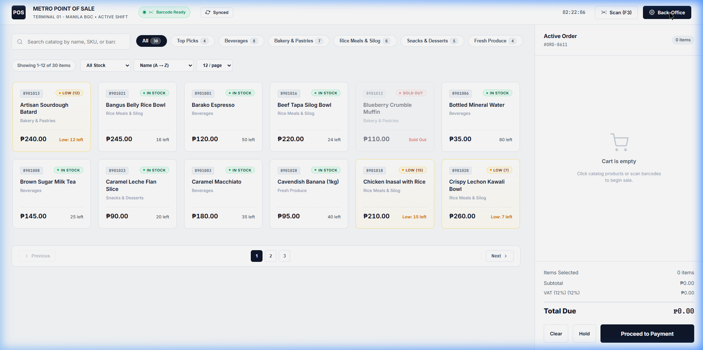
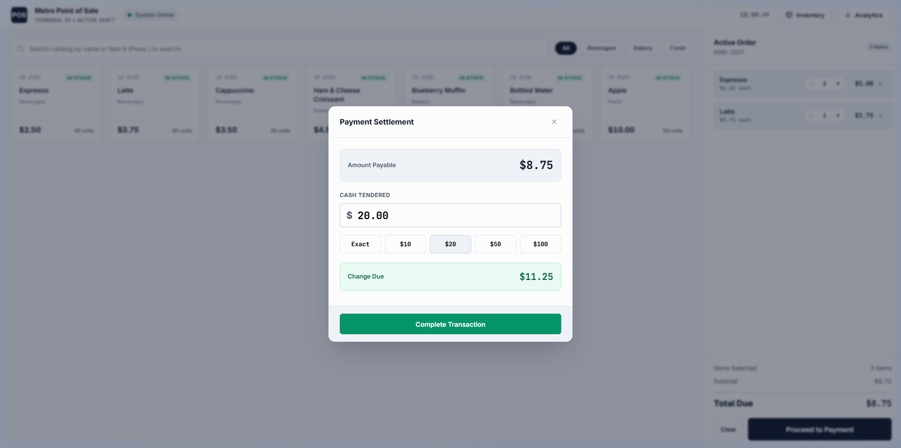
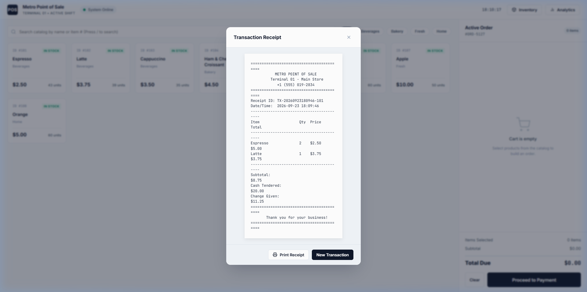
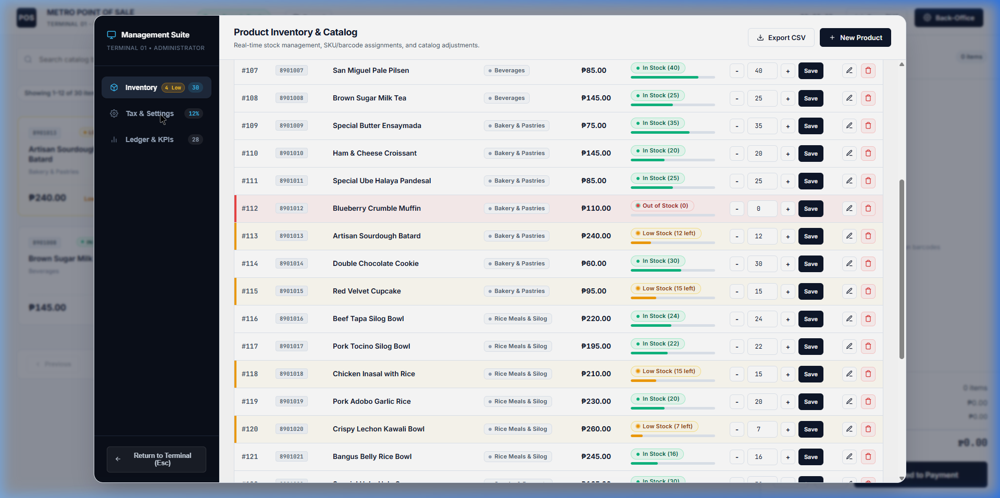
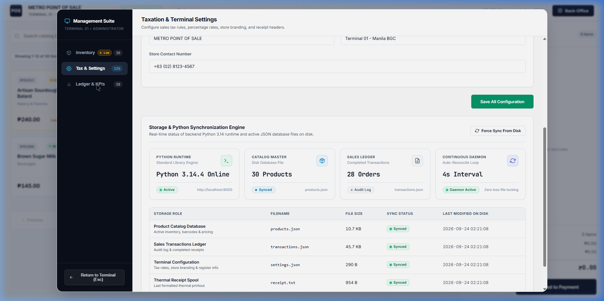

# METRO POINT OF SALE (POS) SYSTEM

[](https://www.python.org/)
[-000000?style=flat-square)](#how-it-works)
[](#project-structure)
[](#key-features)
[](#running-tests)
[-F59E0B?style=flat-square)](#philippine-peso--vat-support)
[](./LICENSE)

> A Point of Sale (POS) system project built using Python and vanilla web technologies (HTML, CSS, JavaScript). It provides both an interactive terminal interface (CLI) and a web browser interface with real-time stock management, cashier tracking, and thermal receipt printing.

---

## Visual Showcase


*High-throughput cashier register interface featuring category filtering, live order totals, and stock indicators.*

---

## Project Overview

This project was developed for our school programming course to show how a functional Point of Sale system can be built from scratch.

- **No Third-Party Packages**: Runs on pure Python standard library—no `pip install`, Flask, Django, or Node.js build tools required.
- **Two Ways to Run**: A full web application in the browser or an interactive command-line terminal menu.
- **Local Data Storage**: All products, sales history, and settings are saved locally in easy-to-read JSON files.
- **Live Syncing**: Updates made in the web interface or directly in files are automatically synced and saved.

---

## System Architecture

```
+-----------------------------------------------------------------------------+
|                                USER INTERFACES                              |
|                                                                             |
|   +------------------------------------+   +----------------------------+   |
|   |   Web Browser Terminal             |   |   CLI Terminal Menu        |   |
|   |   - Interactive Catalog & Search   |   |   - Text-based Cashier View|   |
|   |   - Order Notes & Modifiers        |   |   - Inventory Management   |   |
|   |   - Barcode & Camera Scanner       |   |   - Sales Summary & KPIs   |   |
|   |   - Management Suite (F2)          |   |   - Server Launcher        |   |
|   +-----------------+------------------+   +--------------+-------------+   |
+---------------------|-------------------------------------|-----------------+
                      | HTTP / REST (Port 8000)             | Python Function
                      v                                     v
+-----------------------------------------------------------------------------+
|                                BACKEND CORE                                 |
|                                                                             |
|   +------------------------------------+   +----------------------------+   |
|   |   Web Server (server.py)           |   |   POS Logic (pos_core.py)  |   |
|   |   - Built-in HTTP Server           |   |   - Cart & Price Math      |   |
|   |   - REST API Endpoints             |   |   - Stock Deductions       |   |
|   |   - Static File Server (HTML/CSS)  |   |   - 12% VAT Computation    |   |
|   |   - Real-Time Sync Checks          |   |   - Receipt Formatting     |   |
|   +-----------------+------------------+   +--------------+-------------+   |
+---------------------|-------------------------------------|-----------------+
                      +------------------+------------------+
                                         | Local File I/O
                                         v
+-----------------------------------------------------------------------------+
|                                LOCAL STORAGE                                |
|                                                                             |
|   [products.json]      [transactions.json]    [settings.json]  [receipt.txt]|
|   Product catalog &    History of all         Store details    Latest saved |
|   current stock levels completed sales        & tax rates      thermal bill |
+-----------------------------------------------------------------------------+
```

---

## Key Features

### 1. Cashier Web Terminal
- **Interactive Catalog**: Search by name or barcode, filter by category tabs, and sort by price or stock.
- **Order Management**: Adjust quantities, add custom kitchen notes/modifiers, or park orders for later.
- **Cashier Attribution**: Displays active cashier on the topbar and stamps `Cashier: [Name]` on every receipt.
- **Smart Cash Tender**: Pre-calculated change with quick cash buttons (₱50, ₱100, ₱200, ₱500, ₱1,000).

### 2. Management Suite (`F2`)
- **Inventory Hub**: Add new items, update prices, adjust stock, or delete products.
- **Icon Studio**: Choose from 24 clean retail vector icons when creating or editing items.
- **Stock Indicators**: Yellow warning tags for low stock (15 or below) and red tags for out-of-stock items.
- **Sales History**: Audit ledger showing past orders, items bought, and revenue summary.

### 3. Barcode & QR Scanner (`F3`)
- **Hardware Ready**: Compatible with USB hardware barcode scanners.
- **Phone Camera Scanner**: Allows phones connected to the local Wi-Fi to scan barcodes directly using their rear camera.
- **Instant Search**: Press `/` anywhere to focus on the product search bar.

### 4. Receipts & Verification
- Generates 80mm monospace thermal receipt previews with accurate subtotal, 12% VAT, and change.
- Automatically saves the latest receipt to [receipt.txt](./receipt.txt).
- Generates a scannable transaction QR code on digital receipts.

---

## Screenshot Gallery

| Cash Tender & Change | Thermal Receipt & QR Code |
| :---: | :---: |
|  |  |
| *Cash modal with Philippine Peso denominations* | *Formatted 80mm receipt with cashier name* |

| Management Suite (Inventory) | Real-Time Sync Diagnostics |
| :---: | :---: |
|  |  |
| *Stock manager with inline adjustments* | *Live file monitor tracking JSON changes* |

---

## Philippine Peso & VAT Support

- **Currency**: Standardized to Philippine Peso (`₱` PHP).
- **Taxation**: 12% Value-Added Tax (VAT) calculated automatically on every transaction:
  - `VAT Exempt / Net of VAT`: Base item cost
  - `VAT (12%)`: Tax amount
  - `Total Due`: Final payable amount

---

## Keyboard Shortcuts

| Key | Where | What It Does |
| :---: | :--- | :--- |
| `F2` | Anywhere | Open or close the Management Suite |
| `F3` | Anywhere | Open the Barcode / QR Scanner dialog |
| `/` | Cashier View | Jump focus directly to the search bar |
| `Esc` | Modal View | Close any active modal dialog |
| `Enter` | Search Bar | Select top search result |

---

## How to Run

### Requirements
- **Python 3.10 or higher** (Tested on Python 3.14)
- Modern web browser (Chrome, Edge, Firefox, Brave)
- *No pip packages required.*

### Step 1: Run the Web Version (Recommended)

1. Open your terminal in the project directory:
   ```bash
   python server.py
   ```
2. Open your web browser and navigate to:
   ```
   http://localhost:8000
   ```

### Step 2: Run the CLI Terminal Menu

If you want to use the text-based command prompt interface:
```bash
python pos_system.py
```
Menu options:
- `[1]` Start Cashier Sale
- `[2]` View Product Catalog
- `[3]` Add New Product
- `[4]` Update Product Stock
- `[5]` View Sales Summary & KPIs
- `[6]` Launch Web Server

---

## Running Tests

To verify that the calculations, stock updates, and file saving work as expected:

```bash
# 1. Run core unit tests
python -m unittest test_pos.py

# 2. Run storage synchronization tests
python test_sync_e2e.py
```

---

## Project Structure

```
├── server.py              # Built-in HTTP web server and REST API handler
├── pos_core.py            # Core POS calculations, stock logic, and file saving
├── pos_system.py          # Interactive terminal (CLI) text menu
├── products.json          # Product catalog, prices, and stock counts
├── transactions.json      # Complete record of completed sales
├── settings.json          # Store name, branch, and tax configuration
├── receipt.txt            # Spooled thermal receipt output file
├── test_pos.py            # Core unit test suite
├── test_sync_e2e.py       # End-to-end data saving test script
├── assets/                # Screenshots used in the README documentation
└── static/
    ├── index.html         # Main web terminal and Management Suite layout
    ├── css/
    │   `-- pos.css        # Layout styling, themes, and print stylesheet
    └── js/
        ├── api.js         # API helper functions
        ├── app.js         # Reactive cart state and modal handlers
        `-- qrcode.min.js  # QR code generation library
```

---

## License

This project is created for educational and school project purposes under the MIT License. See [LICENSE](./LICENSE) for details.
